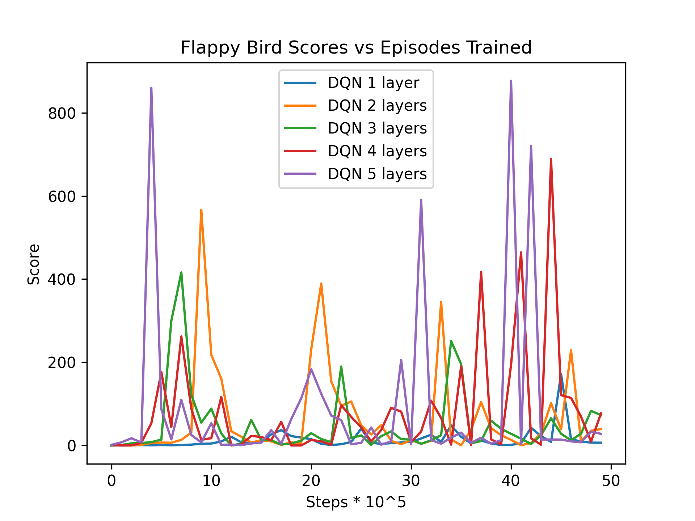

# Flappy Bird with Q-Learning

Reinforcement learning is the systematized approach of learning from sequential decisions. Agents iteratively learn from the environment's response to actions, which consists of the state update and a numerical reward signal. It allows the discovery of solutions that are counterintuitive to humans. It is the foundation of breakthroughs in go, chess, and protein folding.

In this repository, I replicate prior work on the flappy bird game. I technically was successful, but had significant issues with the stability of learning. Upon further reflection, I noticed that all prior work also had significant issues with the stability of learning, but avoided showing this problem through clever display tricks, or chart omission.

## Background

### Markov Decision Processes
Reinforcement learning is a framework for learning from sequential decisions. Markov Decision Processes (MDPs) formalize this process.
MDPs consist of two sets and two functions:
- State space $\mathcal{S}$
- Action space $\mathcal{A}$
- Transition function $P(s'|s,a) \rightarrow [0,1]$
- Reward function $R(s,a) \rightarrow \mathbb{R}$

An agent's interaction with their environment is defined by a trajectory. A trajectory is a sequence of states, actions, and rewards.

$S_0, A_0, R_1, S_1, A_1, R_2, \ldots, S_T$

The agent's goal is to learn a policy $\pi(s) \rightarrow a$ that maximizes the reward signal. The reward signal isn't given by the reward received during a single timestep, but rather the sum of rewards received over the entire trajectory. When making a decision, the agent must consider the future rewards it can expect to receive, but discount them by a factor of $\gamma \in [0,1]$ because they are less certain. $\gamma$ close to 1 makes the agent more forward-looking into the future. $\gamma$ close to 0 makes the agent look for immediate rewards. In most reinforcement learning problems, $\gamma$ is set to 0.99. With calculus, even if t approaches infinity, the sum of rewards is finite.

$$ \sum_{t=0}^{\infty} \gamma^t r_{t+1} = \frac{r_1}{1-\gamma} $$

When the environment dynamics, $P(s'|s,a)$, are known, the agent can use dynamic programming to solve the MDP. It can walk backwards from the terminal state to the initial state, and calculate the value of each state-action pair.If environment dynamics is unknown, the agent can use reinforcement learning to learn the best action for each state.

### Two Learning Paradigms of Reinforcement Learning
The agent has two approaches for learning the best action for each state: (1) Learning the expected return of each state-action pair or (2) learning the optimal action distribution for each state.

#### Value-based Reinforcement Learning
Learning the expected return of each state-action pair is faster, but needs a hardcoded exploration strategy, which needs to be tuned for each environment. For example, using a learning rate of .1 causes the agent to learn absolutely nothing in the flappy bird environment because the optimal action distribution is to jump about 1/20 of the time.

#### Policy-based Reinforcement Learning
Learning the optimal action distribution for each state is more stable, because it naturally systematically explores the environment. Learning action distributions also naturally expand to deal with continuous action spaces.

### Deep Q Learning
Q-Learning is the value-based policy-free approach to reinforcement learning. The agent needs to learn a function $S \times A \rightarrow \mathbb{R}$ that approximates the expected return of each state-action pair. Classical approaches for this problem is to use a Q-Table, which stores the value of each state-action pair in a table.

The problem with Q-Tables is that it is mathematically impossible to represent the value of each state-action pair in a table, if the state space is continuous. Even if the state space is discrete, the table is too large to be practical. The only solution is to compress the state space so that Q-tables are feasible.[kyokin78. rl-flappybird, Github, 2019](https://github.com/kyokin78/rl-flappybird) utilizes this approach to beat the game.

[Mnih et al. 2013](https://www.nature.com/articles/nature14236) used convolutional neural networks to compress the state space, and beat Atari games. To contend with the dynamics of the environment, they randomly sampled from a replay buffer to decorrelate the samples. Then they learned the Q-values of each state-action pair, using temporal difference learning.

$$Q(s,a,\theta) \leftarrow r + \gamma \max_{a'} Q(s',a',\theta)$$

## Related Work

1. [Chen. Deep Reinforcement Learning for Flappy Bird. Stanford Final Project, 2015](https://cs229.stanford.edu/proj2015/362_report.pdf)
 - Learns from pixels to play flappy bird
 - Uses DQN from Mnih et al. w/ target network
2. [Yenchenlin. Deep Reinforcement Learning for Flappy Bird. Github, 2016](https://github.com/yenchenlin/DeepLearningFlappyBird)
 - Implementation of the approach. Inspired by the work of Chen. Modified the velocity so that the bird doesn't jump as high
3. [johnnycode8. Train the DQN Algorithm on Flappy Bird, Youtube, 2024](https://github.com/johnnycode8/dqn_pytorch)
 - Implements the dueling-dqn approach on the simplified observation space.
4. [xviniette. Flappy Bird with PPO, Github, 2024](https://github.com/xviniette/FlappyLearning)
 - Implements the PPO approach on the simplified observation space.
5. [markub3327. flappy-bird-gymnasium, Github, 2023](https://github.com/markub3327/flappy-bird-gymnasium)
 - Implements the Dueling DQN approach on two state representations: (1) the simplified observation space (2) LIDAR measurements of the environment.
6. [SarvagaVaish. FlappyBirdRL, Github, 2014](https://github.com/SarvagyaVaish/FlappyBirdRL)
 - Simplified observation space and used a QTable to implement a perfect agent.
7. [kyokin78. rl-flappybird, Github, 2019](https://github.com/kyokin78/rl-flappybird)
 - Further simplified the simplified observation space and used a QTable to implement a perfect agent. Inspired by the work of SarvagaVaish.
8. [foodsung. DRL-FlappyBird, Github, 2016](https://github.com/foodsung/DRL-FlappyBird)
 - Inspired by yenchenlin. Provides an even more mature implementation.

## Flappy Bird
- Mobile game from 2013 that went viral
- Simple game mechanics make it an ideal candidate for reinforcement learning tasks
- RL environment exists at [flappy-bird-gymnasium](https://github.com/markub3327/flappy-bird-gymnasium)
- Simplified observation space 12 features, [0,1]

## Methods

Stable-baselines3 is a library for reinforcement learning written in pytorch. There are many other RL libraries like [stable-baselines](https://github.com/hill-a/stable-baselines), [raylib](https://github.com/ray-project/ray), and [acme](https://github.com/deepmind/acme), but I found those libraries to be outdated and not well-maintained.

### Results

| Name | Mean Score (1000 runs) | Std Score (1000 runs) |
|------|------------------------|-----------------------|
| 2 layers 1.3M steps | 172| 192 |
| 3 layers 2M steps | 567| 388 |
| 4 layers 2M steps | 416 | 360 |
| 5 layers 2M steps | 689 | 366 |
| 6 layers 2M steps | 877 | 342 |
| handcrafted agent | **954** | **170** |

### Stability of Learning

[Video of version 2](videos/dqn_flappybird_v2_20250103-030423.mp4)
- Seems that more layers helped generalize faster
  - Could be due to the fact that the agent is able to learn more complex patterns
- Catastrophic forgetting
  - evident in all prior work
- Mnih et al. 2013,
  - obscures this by choosing optimistic charts
  - arbitrary q-value chart to show "stability"
- No other prior work shows catastrophic forgetting
  - Including this chart makes the research look less valuable

### Further Work
- Learn directly from pixels
- Experiment with transformer models
- Experiment with Partially Observable Environments
- Try Hindsight Experience Replay
- Try Policy-based methods
- Duplicated neurons with different learning rates

## Conclusion
- Stable-baselines3 is a powerful tool for reinforcement learning
- Prior work heavily overstates the stability of learning
- Catastrophic forgetting is a common problem
  - function approximation with dynamic environments

## Postmortem
- should have started with replicating prior work
- had trouble deciding when to stop
  - interesting follow-up questions
  - deadlines exist
- update results differently
  - time-based instead of milestone-based
