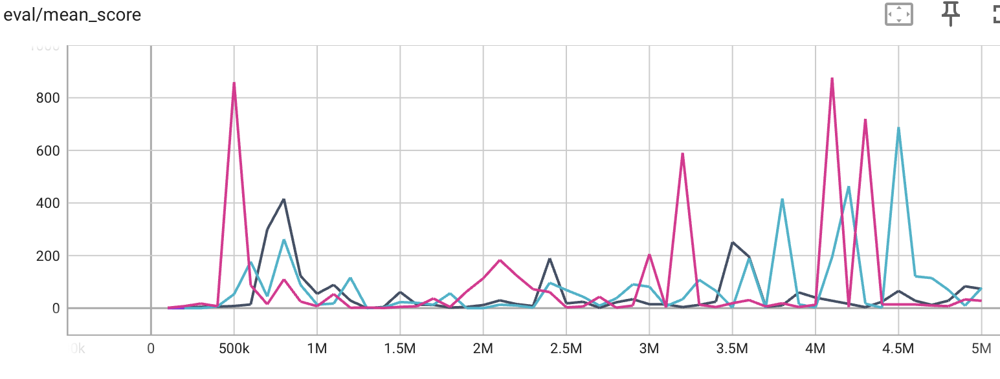

# Catching up to Anduril

---

# Career Summary

Path Planning
- Navigation
- Motion Planning
- Autonomy

Automated Target Recognition
- Single Shot Detector (SSD)
- Real-time Detection Transformers (RT-DETR)

---
# Path Planning
allows robots to control their own location

---
# Navigation
- Developed path planning algorithms for UAVs
- Collapsed euclidean space into a smaller graph
    - Shortest path problem
- $\mathcal{O}(n^4)$ complexity
---
# Motion Planning
- Research on motion planning for UAVs
- A convex optimization based approach to motion planning

---
# Autonomy
- Allows robots to conduct surveillance independently
- Latency graphs
---
# Automated Target Recognition
allows robots to detect meaningful targets in the environment

---
# Single Shot Detector (SSD)
- Responsible for End-to-End Object Detection
- Uses convolutional filters to filter feature maps into objects

---

---
# Real-time Detection Transformers (RT-DETR)
- Uses attention for translational context
- Worked as a software engineer
    - Wrote unit tests
    - Ran experiments
---
# Reinforcement Learning
a sequential decision making framework

---
# Background
- A mathematical framework for decision making
- Formally described with Markov Decision Processes (MDPs)
   - state space $\mathcal{S}$
   - action space $\mathcal{A}$
   - transition function $T: \mathcal{S} \times \mathcal{A} \rightarrow \mathcal{S}$
   - reward function $R: \mathcal{S} \times \mathcal{A} \rightarrow \mathbb{R}$
- each interaction with the environment is a **trajectory**
    - $s_0, a_0, r_0, s_1, a_1, r_1, \ldots, s_T$
---
# Types of Reinforcement Learning
- RL varies on two dimensions
    - Policy-based vs Value-based
    - Model-based vs Model-free
---
# Policy-based vs Value-based
- Policy-based: For each state, learn the best action distribution
    - Learn a policy function $\pi: \mathcal{S} \rightarrow \mathcal{A}$
- Value-based: For each state-action pair, learn the expected future reward
    - Learn a value function $V: \mathcal{S} \times \mathcal{A} \rightarrow \mathbb{R}$

---
# Model-based vs Model-free
- Model-free: Learn a model of the environment $M: P(S',R|S,A)$
    - Then compute the optimal state-actions
- Model-based: With the next state known, compute the optimal state-actions
    - **MCTS** Monte Carlo Tree Search
---
# Flappy Bird
- Model-free Off-Policy Reinforcement Learning
- Used Neural Network to approximate Q function
    - Use Target Q Network to makes sure that large Q updates are slower
    - Represent Q(s,a) as Advantage(s,a) + Value(s)
---
# Results
- Unstable learning but got lucky

---
