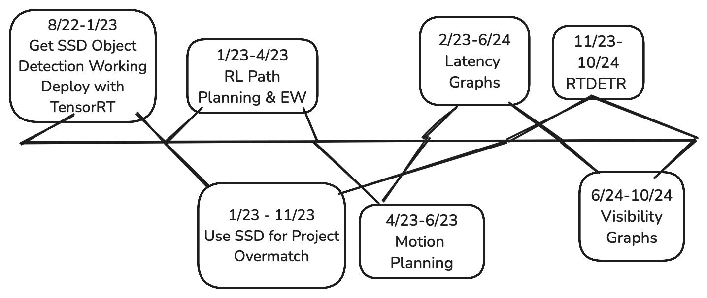
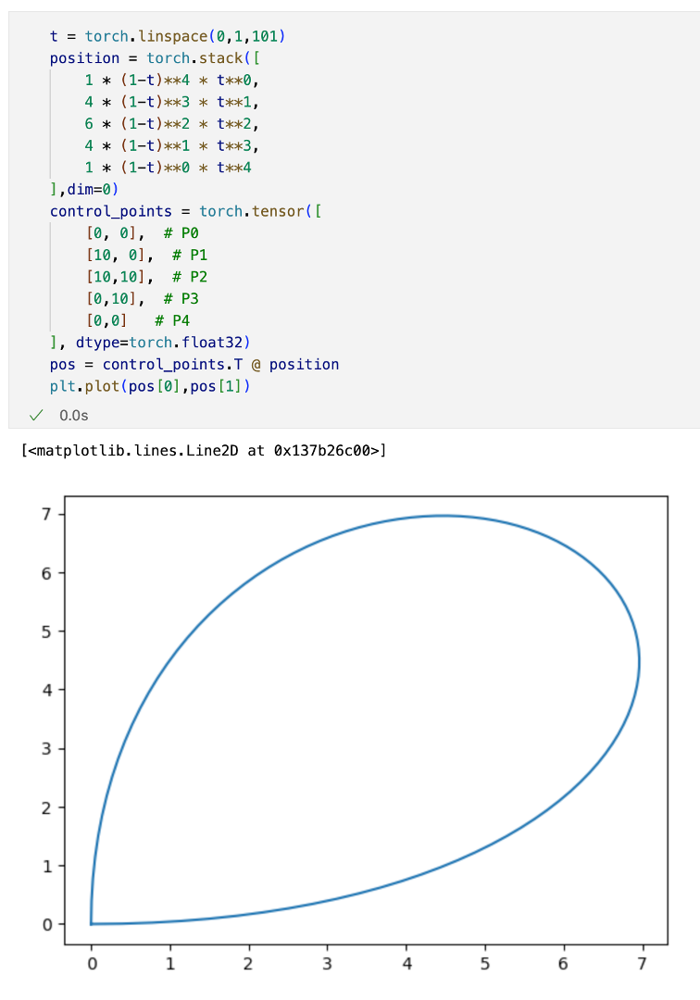
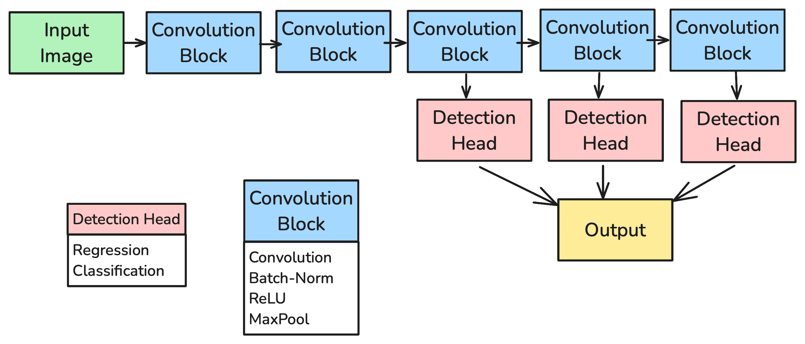

# Catching up to Anduril

---

# Career Summary
- **Path Planning** : Navigation, Motion Planning, Autonomy
- **Automated Target Recognition** : SSD, RT-DETR

---
# Path Planning
allows robots to control their own location

---
# Navigation
- Obstacle avoidance
- Collapsed euclidean space into a smaller graph
    - Shortest path problem
- Input: List of 2D points
- Output: Optimal waypoints
- Assumes positional control
---
# Implementation
- Wasn't able to find bugless implementation online
- [Distance Tables Part 2: Lee's Visibility Graph Algorithm](https://taipanrex.github.io/2016/10/19/Distance-Tables-Part-2-Lees-Visibility-Graph-Algorithm.html)
    - Raycasting bug, stopped me from investigating further
- [Visibility Graph](https://github.com/matthewachan/vgraph)
    - Doesn't implement check for adjacent edges
    - Fails for non-convex polygons
- Worked as intended for production
---
# Postmortem
- Didn't look hard enough for open source implementations
- [Computational Geometry Algorithms Library](https://doc.cgal.org/latest/Visibility_2/classVisibility__2.html#a9bbdc7e63c4c9ceca6cc5f0d6e3c549a)
    - Haven't personally tested it
---
# Motion Planning
- [Motion Planning around Obstacles with Convex Optimization](https://arxiv.org/abs/2205.04422)
- Control of acceleration instead of position
- How to navigate using acceleration
---
# Motion Planning with Bezier Curves
- Represent path trajectory as a Bezier curves
    - List of **control points**
- Differential gurantees of configuration
    - First and last sets position
    - 2nd and 2nd-last last sets velocity
- Used pytorch as a nonlinear optimizer
---
{width="20%"}

---
# Postmortem
- Tobia Marcucci's Thesis:
[Graphs of Convex Sets with Applications to Optimal Control and Motion Planning](https://dspace.mit.edu/bitstream/handle/1721.1/156598/marcucci-tobiam-phd-eecs-2024-thesis.pdf?sequence=1&isAllowed=y)
    - Distilled everything that I was working much more simply, but hadn't existed at the time
- Should have searched for drake first
    - [Drake](https://drake.mit.edu/)
---
# Autonomy
- Allows robots to conduct surveillance independently
- Latency graphs
---
# Latency Graphs Part 1
- Weighted Graphs, but each node has a weight
    - 4 sets: $G(V,E,\phi,l)$
    - $V$ is the set of nodes
    - $E$ is the set of edges
    - $\phi: V \rightarrow \mathbb{R}$ is the priority function
    - $l : E \rightarrow \mathbb{R}$ is the latency function
---
# Latency Graphs Part 2
- Find an infinite walk that minimizes the maximum weighted latency
- technically not a Hamiltonian cycle
    - The walk can visit nodes more than once
---
# Results
- Python Simulation of algorithm
- Built powerpoint for BD, never used externally

---
# Postmortem
- Nontechnical audience
    - should have used "Artificial Intelligence"
    - instead of "A Mathematical Framework for Surveillance"
---
# Automated Target Recognition
allows robots to detect meaningful targets in the environment

---
# Single Shot Detector (SSD)
- Responsible for End-to-End Object Detection
    - Was given a private codebase as a starting point
- Uses convolutional filters to filter feature maps into objects

---
# Details
- Used Unreal Engine Simulation to generate training data
    - A different team worked on the simulation
- Used Keras to implement the model
    - Private codebase of predecessor
- Deployed the model to a Xavier NX
    - Used Onnx, TensorRT, for deployment
---
# Results
- Performed well for 4 demo cycles
    - Compute budget relaxed and we moved to RT-DETR
---
# Postmortem
- Used open source unit tests instead of custom ones
---

# Real-time Detection Transformers (RT-DETR)
- Uses attention for translational context
- Worked as a software engineer
    - Wrote unit tests / documentation
    - Ran experiments
    - Made dataloaders
---
# Reinforcement Learning
allows robots to learn from sequential decision making

---
# Background
- Formally described with Markov Decision Processes (MDPs)
   - state space $\mathcal{S}$
   - action space $\mathcal{A}$
   - transition function $T: \mathcal{S} \times \mathcal{A} \rightarrow \mathcal{S}$
   - reward function $R: \mathcal{S} \times \mathcal{A} \rightarrow \mathbb{R}$
- each interaction with the environment is a **trajectory**
    - $s_0, a_0, r_0, s_1, a_1, r_1, \ldots, s_T$
---
# Types of Reinforcement Learning
- RL varies on two dimensions
    - Policy-based vs Value-based
    - Model-based vs Model-free
---
# Policy-based vs Value-based
- Policy-based: For each state, learn the best action distribution
    - Learn a policy function $\pi: \mathcal{S} \rightarrow \mathcal{A}$
- Value-based: For each state-action pair, learn the expected future reward
    - Learn a value function $V: \mathcal{S} \times \mathcal{A} \rightarrow \mathbb{R}$

---
# Model-based vs Model-free
- Model-free: Learn a model of the environment $M: P(S',R|S,A)$
    - Then compute the optimal state-actions
- Model-based: With the next state known, compute the optimal state-actions
    - **MCTS** Alpha{Go,Zero}
---
# **Example**  Flappy Bird
- Continuation of project started in college
- Model-free Off-Policy Reinforcement Learning
- Used Neural Network to approximate Q function
---
# Results
- Unstable learning but got lucky
- All prior work didn't mention catastrophic forgetting
    - Results don't look as impressive
---
# Future Work
- Add prioritized experience replay to stable-baselines3
    - Currently not implemented because it requires a segment tree
- Use transformer-based models to solve Partially Observable MDPs (POMDPs)
- Learn directly from pixels
    - Original plan, but wanted to get something "basic" working first

---
# Postmortem
- First step should have been to replicate the work of others
- Had trouble with deciding when to stop
    - Always more interesting questions, but deadlines exist
